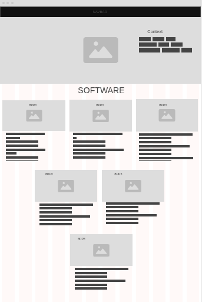

# Plan

## Wireframes
* [Mobile]()
* [Desktop]()

## Colors

 #B3E5FC

#81D4FA

#4FC3F7

#29B6F6

#0288D1

#F5F5F5

#EOEOEO

#BDBDBD

#9E9E9E

#757575`

## Fonts
* [Bebas Neue](https://fonts.google.com/specimen/Bebas+Neue)

* [Inter](https://fonts.google.com/specimen/Inter)

* [Open Sans](https://fonts.google.com/specimen/Open+Sans)

## Timeline

#### MVP

*  April 22nd: pick out the template, colors,fonts, images needed for the webiste

*  April 23rd : Start with making the navbar and make sure it's responsive.

*  April 24th: Make the title part and add the context on the image where the title is.

*  April 25th: Start by coding the software part and try to finsih it like making the boxes with the
decriptions of the apps

* April 28th: Start coding the hardware part/ finding all the videos and adding the information about it.

* April 29th: make the carousel of the medical images and do the context part for the possible future inventions

* April 30th: Code the possible furture inventions part with descriptions on them.

* May 1st: Add the conclusion part on why this website was made and the rating part.

* May 2nd: Use flexbox and try to make it look better with flexbox.

* May 3rd: Look for any errors in the mvp and review the rubric to see if im missing anything.
---

#### Beyond MVP

* Task

<!-- DO NOT USE THIS YET

| Name | Glows | Grows |
| -------- | ------- | ------- |
|   |   |
|   |   |
|   |   |
|   |   |
|   |   |
|   |   |

-->
